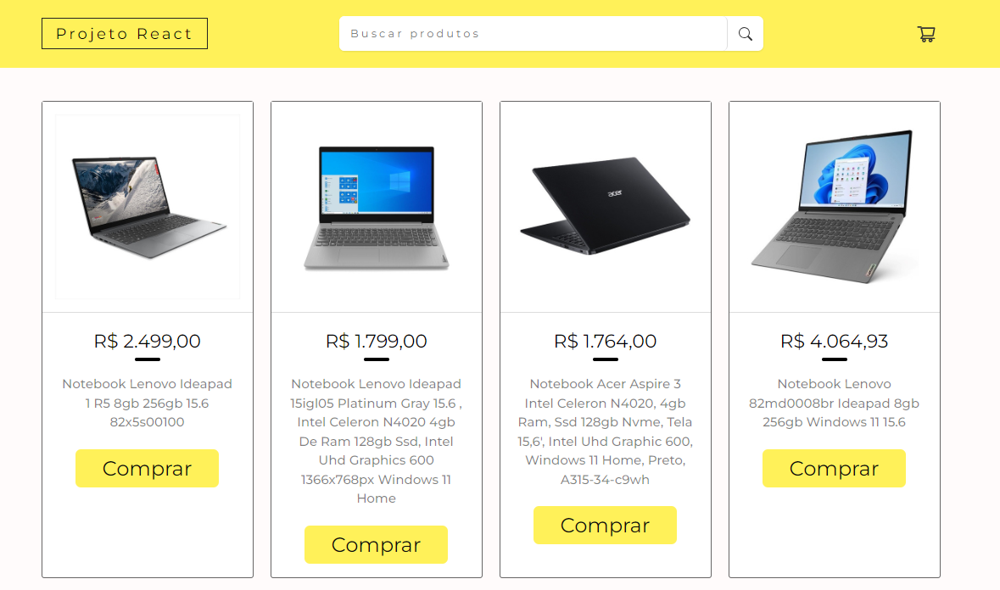
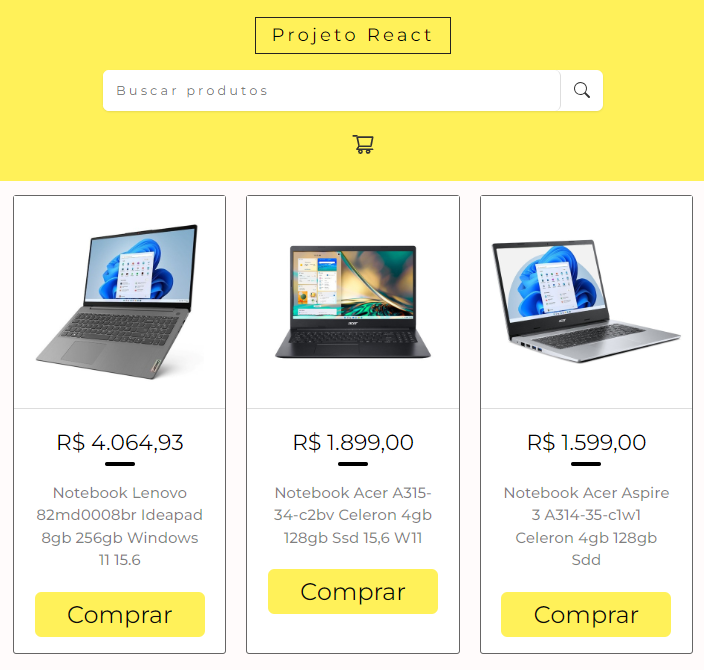

# Projeto: API's do Mercado Livre

<p>
O projeto em React com styled components e API's do Mercado Livre é uma aplicação de busca e exibição de produtos. Os usuários podem pesquisar produtos através de palavras-chave, e os resultados são obtidos em tempo real por meio da integração com as API's do Mercado Livre.

</p>

<p>
  A interface é desenvolvida usando styled components para criar estilos reutilizáveis e componentes modulares. Os detalhes do produto selecionado são exibidos em uma página separada, incluindo informações como título, descrição, preço e imagem. A aplicação proporciona uma experiência de usuário intuitiva e agradável, facilitando a navegação e interação com os produtos do Mercado Livre.
</p>

## Tecnologias e Ferramentas usadas no desenvolvimento da aplicação:

<ul>
  <li>Explorando funções e bibliotecas do React.js</li>
  <li>GitHub</li>
  <li>Configurações Eslint</li>
  <li>Figma</li>
  <li>VScode</li>
</ul>

## Links: API's Mercado Livre.

<ul>
  <li>Link: https://api.mercadolibre.com/sites/MLB/#json</li>
  <li>Documentação: https://developers.mercadolivre.com.br/pt_br/produto-receba-notificacoes</li>
</ul>

## Layout da Aplicaçao para telas em Desktops, Tablets e Mobile.

 - Listagem de Produtos;
 - Pesquisa de Produtos usando palavras-chave de acordo com as informações da API's do Mercado Livre;
 - Adição ao Carrinho;
 - Remoção do Carrinho;
  

## Método de uso da aplicação:

<span>Dentro do diretório do projeto, você pode executar:</span>

### Comandos para rodar o projeto:

<span>GitHub:</span>

```
  git init
  git status
  git clone git@github.com:devalbertomoiseis/projeto-react-mercado-livre.git
```

<span>Npm:</span>

```
  npm install --save
  npm start
```

#### Resultado:

Local: http://localhost:3000 <br/>
On Your Network: http://192.168.0.9:3000

<span>Observações:</span>

`npm start`

<p>
  Executa o aplicativo no modo de desenvolvimento.\
  Abra [http://localhost:3000](http://localhost:3000) para visualizá-lo em seu navegador.
</p>

<p>
  A página será recarregada quando você fizer alterações.\
Você também pode ver erros de lint no console. 
</p>

`npm test`

<p>
  Inicia o executor de teste no modo de observação interativo.\
Consulte a seção sobre [execução de testes](https://facebook.github.io/create-react-app/docs/running-tests) para obter mais informações.
</p>

`npm run build`

<p>
Cria o aplicativo para produção na pasta `build`.\
Ele empacota corretamente o React no modo de produção e otimiza a compilação para obter o melhor desempenho.
</p>

<p>
  A compilação é minificada e os nomes dos arquivos incluem os hashes.\
Seu aplicativo está pronto para ser implantado!
</p>

`npm run eject`

<span>
  Nota: esta é uma operação unidirecional. Depois de 'ejetar', você não pode voltar!\*\*
</span>

<p>
  Se você não estiver satisfeito com a ferramenta de construção e opções de configuração, você pode `ejetar` a qualquer momento. Este comando removerá a dependência de compilação única do seu projeto.
</p>

<p>
  Em vez disso, ele copiará todos os arquivos de configuração e as dependências transitivas (webpack, Babel, ESLint, etc) diretamente para o seu projeto, para que você tenha controle total sobre eles. Todos os comandos, exceto `eject`, ainda funcionarão, mas apontarão para os scripts copiados para que você possa ajustá-los. Neste ponto você está por conta própria.
</p>


### Layout da Aplicaçao para telas em Desktops, Tablets e Mobile.

<p>Mercado - Desktop</p>

 <br/>

<p>Mercado - Tablet</p>

 <br/>

<p>Mercado - Mobile</p>

 <br/>
