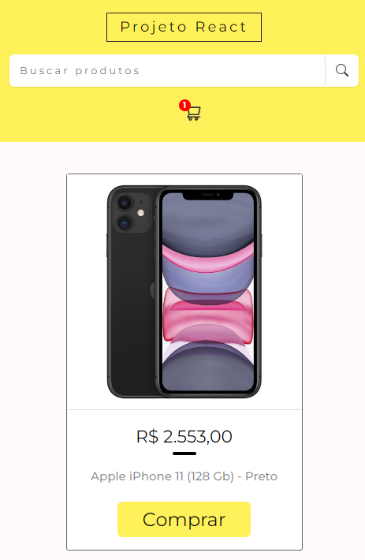

# Projeto: API's do Mercado Livre

<p>
O projeto em React com styled components e API's do Mercado Livre é uma aplicação de busca e exibição de produtos. Os usuários podem pesquisar produtos através de palavras-chave, e os resultados são obtidos em tempo real por meio da integração com as API's do Mercado Livre.

</p>

<p>
  A interface é desenvolvida usando styled components para criar estilos reutilizáveis e componentes modulares. Os detalhes do produto selecionado são exibidos em uma página separada, incluindo informações como título, descrição, preço e imagem. A aplicação proporciona uma experiência de usuário intuitiva e agradável, facilitando a navegação e interação com os produtos do Mercado Livre.
</p>

## Tecnologias e Ferramentas usadas no desenvolvimento da aplicação:

<ul>
  <li>Explorando funções e bibliotecas do React.js</li>
  <li>GitHub</li>
  <li>Configurações Eslint</li>
  <li>Figma</li>
  <li>VScode</li>
</ul>

## Links: API's Mercado Livre.

<ul>
  <li>Link da API: https://api.mercadolibre.com/sites/MLB/#json</li>
  <li>Documentação: https://developers.mercadolivre.com.br/pt_br/produto-receba-notificacoes</li>
  <li>Deploy: https://projeto-react-campinho-digital.netlify.app/</li>
</ul>

## Funções do Projeto

- Listagem de Produtos;
- Pesquisa de Produtos usando palavras-chave de acordo com as informações da API's do Mercado Livre;
- Adição ao Carrinho;
- Remoção do Carrinho;

## Método de uso da aplicação:

<span>Dentro do diretório do projeto, você pode executar:</span>

### Comandos para rodar o projeto:

<span>GitHub:</span>

```
  git init
  git status
  git clone git@github.com:devalbertomoiseis/projeto-react-mercado-livre.git
```

<span>Npm:</span>

```
  npm install --save
  npm start
```

#### Resultado:

Local: http://localhost:3000 <br/>
On Your Network: http://192.168.0.9:3000

### Layout da Aplicaçao para telas em Desktops, Tablets e Mobile.

<p>Mercado - Desktop</p>

 <br/>

<p>Mercado - Tablet</p>

 <br/>

<p>Mercado - Mobile</p>

 <br/>
